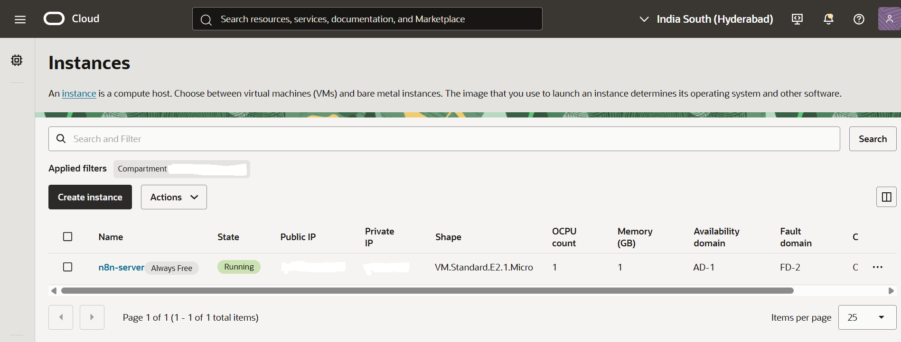
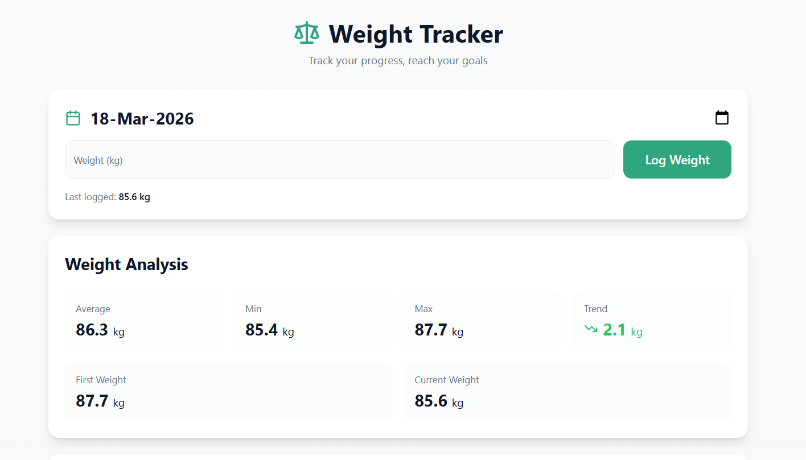
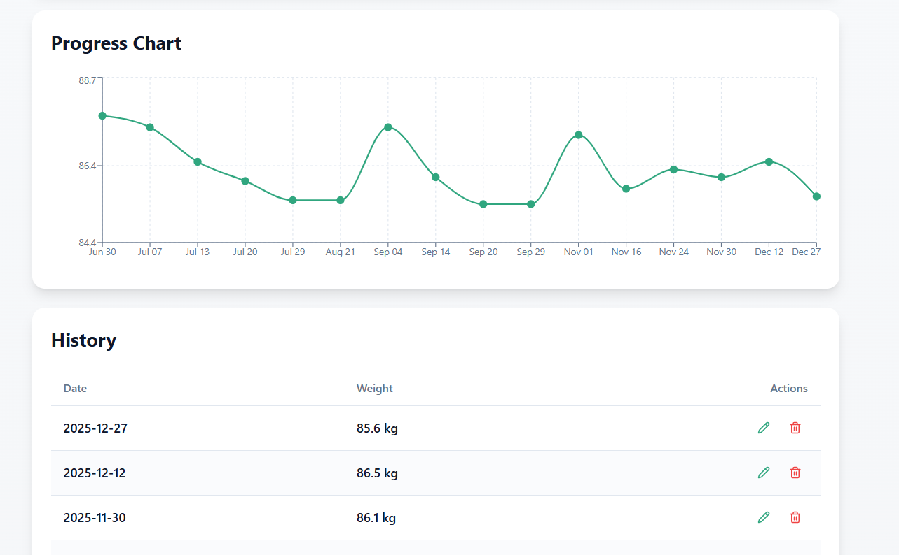
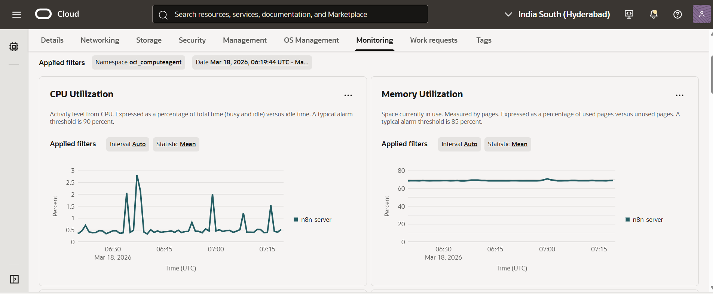

# 🏋️ Weight Tracker (Deployed on Oracle Cloud Infrastructure)

A beautiful, modern weight tracking application built with React, TypeScript, and TailwindCSS. Track your weight loss or gain journey with an intuitive interface, powerful analytics, and flexible data management.


## ☁️ Oracle Cloud Infrastructure (OCI) Deployment

This application is deployed on an Oracle Cloud Infrastructure (OCI) Linux-based compute instance, demonstrating real-world cloud usage.

### Infrastructure Details
- **Usage Context**: General-purpose VM hosting multiple applications (including n8n and this project)
- **Compute Instance**: OCI Linux VM  
- **Instance Shape**: VM.Standard.E2.1.Micro
- **Networking**:
  - Virtual Cloud Network (VCN) configured
  - Public IP assigned for external access
  - Security rules allowing HTTP/HTTPS traffic
- **Access**:
  - SSH used for deployment and management
- **Hosting**:
  - Application deployed and served from VM
  - Domain mapped to public IP

## 🧱 Architecture

User → Browser → Domain → OCI VM (Linux) → Node.js App → Local Storage

- Frontend hosted on OCI compute instance
- Application served via Node.js runtime
- Public access enabled through configured networking

## ✨ Features

### 📊 Comprehensive Analytics
- **Statistical Overview**: View average, minimum, maximum weights
- **Progress Tracking**: See total weight change from start to current
- **Visual Charts**: Interactive line charts showing your weight journey over time
- **Trend Analysis**: Understand your progress at a glance

### 📝 Easy Weight Logging
- Simple, intuitive input form with date picker
- Automatic duplicate detection - updates existing entries
- Manual date selection or use today's date
- Real-time validation and feedback

### 🔄 Flexible Data Management
- **Backup & Restore**: Export/import complete history as JSON
- **CSV Support**: Import historical data from spreadsheets
- **Multiple Date Formats**: Supports virtually any date format
  - ISO: `YYYY-MM-DD`
  - European: `DD/MM/YYYY`, `DD-MM-YYYY`, `DD.MM.YYYY`
  - US: `MM/DD/YYYY`, `MM-DD-YYYY`
  - Compact: `YYYYMMDD`
  - Short years: `DD/MM/YY`, `MM/DD/YY`
- **Edit History**: Modify past entries with ease
- **CSV Templates**: Download pre-formatted templates for bulk imports

### 📱 Responsive Design
- Fully responsive across all devices (mobile, tablet, desktop)
- Touch-friendly interface
- Optimized for both portrait and landscape orientations
- Progressive Web App ready

### 💾 Local Storage
- All data stored locally in your browser
- No server required, complete privacy
- Instant load times
- Works offline

## 📦 Tech Stack

- **Frontend Framework**: React 18.3.1
- **Language**: TypeScript
- **Styling**: TailwindCSS with custom design system
- **Build Tool**: Vite
- **UI Components**: Shadcn/ui with Radix UI primitives
- **Charts**: Recharts
- **Icons**: Lucide React
- **Date Handling**: date-fns
- **Routing**: React Router DOM
- **Toast Notifications**: Sonner
- **Cloud Platform**: Oracle Cloud Infrastructure (OCI)
- **OS**: Linux

## 🧠 Development Approach

The initial version of this application was generated using Lovable (an AI-assisted development platform). 

The application was then significantly customized and extended manually based on specific requirements. This included modifying the codebase, improving features, and adapting the application structure.

The deployment and infrastructure setup were fully performed manually on Oracle Cloud Infrastructure (OCI), including:
- Provisioning the compute instance
- Configuring networking and security rules
- Deploying and managing the application on a Linux-based VM

This project demonstrates the ability to:
- Work with and extend AI-generated code
- Understand application architecture and behavior
- Deploy and manage applications in a real cloud environment

## ⚙️ Deployment on OCI
1. Provisioned OCI Compute Instance
2. Configured VCN and security rules
3. Connected via SSH
4. Installed Node.js environment
5. Cloned repository
6. Built and started application
7. Exposed via public IP and domain  
8. Configured application port and ensured accessibility through OCI security rules

## 📖 Usage Guide

### Adding Your First Weight Entry
1. Enter your weight in kilograms
2. Select the date (defaults to today)
3. Click "Log Weight"
4. View your entry in the history table below

### Editing an Entry
1. Find the entry in the history table
2. Click the "Edit" button
3. Modify the date or weight
4. Click "Update Weight"

### Importing Historical Data

#### Method 1: CSV Template
1. Click "Download Template" in the Data Management section
2. Fill in your dates and weights
3. Save the file
4. Click "Import CSV" and select your file

#### Method 2: Manual CSV Creation
Create a CSV file with this format:
```csv
date,weight
2025-01-01,70.5
2025-01-02,70.3
07-01-25,70.1
```

#### Method 3: JSON Backup
If you have a backup file from a previous session:
1. Click "Restore Backup"
2. Select your JSON backup file
3. Confirm the restore

### Exporting Your Data
- **JSON Backup**: Full backup for restoration
- **CSV Export**: For use in spreadsheets or other tools

## 🎯 Real-World Usage

This application is actively used as a personal fitness tracker to monitor daily weight and progress.

It demonstrates:
- Real-world deployment on OCI
- Continuous usage of a cloud-hosted application
- Practical implementation of a production-like setup

## ⚠️ Challenges Faced

- Configuring security rules for public access
- Managing port exposure on the VM
- Setting up domain mapping

## 📚 Learnings

- Hands-on experience with OCI compute and networking
- Deploying applications on Linux cloud environments
- Managing public access and security configurations

## 🎨 Customization

The app uses a comprehensive design system defined in:
- `src/index.css` - Color tokens, animations, gradients
- `tailwind.config.ts` - Theme configuration

You can easily customize colors, fonts, and spacing by modifying these files.

## 📊 Supported Date Formats

The app intelligently parses various date formats:

| Format | Example | Description |
|--------|---------|-------------|
| YYYY-MM-DD | 2025-01-15 | ISO standard |
| YYYY/MM/DD | 2025/01/15 | Slash separator |
| DD-MM-YYYY | 15-01-2025 | European dash |
| DD/MM/YYYY | 15/01/2025 | European slash |
| DD.MM.YYYY | 15.01.2025 | European dot |
| MM/DD/YYYY | 01/15/2025 | US format |
| DD-MM-YY | 15-01-25 | Short year dash |
| DD/MM/YY | 15/01/25 | Short year slash |
| YYYYMMDD | 20250115 | Compact |

## 🔒 Privacy & Security

- **100% Local**: All data stored in your browser's local storage
- **No Tracking**: No analytics, no cookies, no external requests
- **No Account Required**: Start using immediately
- **Data Ownership**: Export your data anytime in standard formats

## 📸 Screenshots

### OCI Compute Instance (Running)


### Application Running on OCI



### System Monitoring (OCI Metrics)



## 🤝 Contributing

Contributions are welcome! Please feel free to submit a Pull Request. For major changes, please open an issue first to discuss what you would like to change.

1. Fork the repository
2. Create your feature branch (`git checkout -b feature/AmazingFeature`)
3. Commit your changes (`git commit -m 'Add some AmazingFeature'`)
4. Push to the branch (`git push origin feature/AmazingFeature`)
5. Open a Pull Request

## 📝 License

This project is open source and available under the MIT License.

## 🐛 Bug Reports & Feature Requests

Please use the [GitHub Issues](https://github.com/YOUR_USERNAME/YOUR_REPO_NAME/issues) page to report bugs or request features.

## 🙏 Acknowledgments

- Built with [Lovable](https://lovable.dev)
- UI components from [shadcn/ui](https://ui.shadcn.com)
- Icons from [Lucide](https://lucide.dev)
- Charts powered by [Recharts](https://recharts.org)

## 📞 Support

If you have any questions or need help, please open an issue on GitHub.

---

**Made with ❤️ for health and fitness enthusiasts**

⭐ Star this repo if you find it helpful!

## 🔗 Links

- **Live Demo**: [View Live Page](https://weight.nobelwolf.gleeze.com)
